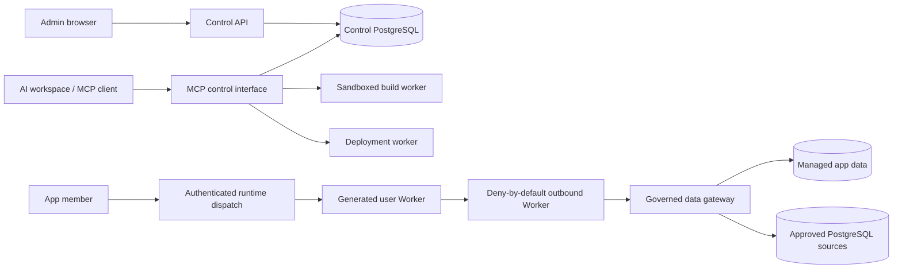

# Toolflow

Toolflow is an agent-first control and deployment plane for governed internal tools. Builders work through MCP from their existing AI workspace; admins use a small web application for identity, connections, catalog curation, and operational oversight.

The local MVP implements the PRD workflow and security boundaries. It is not production-ready until the provider-backed items in [the pilot checklist](docs/pilot-readiness-checklist.md) have evidence.

For the hosted MVP, use the [Vercel, Supabase, Cloudflare, and WorkOS deployment guide](docs/mvp-deployment.md).

## Architecture



Important boundaries:

- Organization, user, role, and app access are re-authorized server-side.
- Source versions and build artifacts are immutable and content-addressed.
- Production deployment requires an exact successful preview, revalidates catalog guardrails, applies only additive managed-schema changes, and atomically activates the immutable artifact.
- Generated code receives neither company database credentials nor control-plane secrets.
- External SQL is parsed and constrained; managed data is isolated by app and environment.
- Security audit events are append-only and separate from operational usage telemetry.

## Local development

Prerequisites: Node.js 22+, pnpm 10.15+, Docker, and Docker Compose.

```sh
pnpm install
cp .env.example .env
docker compose up -d postgres
set -a
source .env
set +a
pnpm db:migrate
pnpm db:seed
pnpm dev
```

Before starting, replace the development service-token placeholders in `.env` with values of at least 32 characters. The development encryption/context defaults are intentionally rejected in production.

Local endpoints:

- Admin: `http://127.0.0.1:5173`
- Control API: `http://127.0.0.1:3000`
- MCP: `http://127.0.0.1:3001/mcp`
- Runtime dispatcher: `http://127.0.0.1:3004`
- Data gateway: `http://127.0.0.1:3005`
- Deployment worker: `http://127.0.0.1:3006`

## Verification

```sh
pnpm format:check
pnpm check
pnpm test:integration
pnpm test:e2e
```

The live MCP lifecycle test additionally requires the local services:

```sh
MCP_INTEGRATION_URL=http://127.0.0.1:3001/mcp \
CONTROL_API_URL=http://127.0.0.1:3000 \
pnpm --filter @toolflow/mcp test
```

See the [requirement audit](tasks/requirements-audit.md), [browser evidence](docs/browser-verification.md), [authorization matrix](docs/security/authorization-test-matrix.md), and [threat model](docs/security/threat-model.md) for the current acceptance record.
